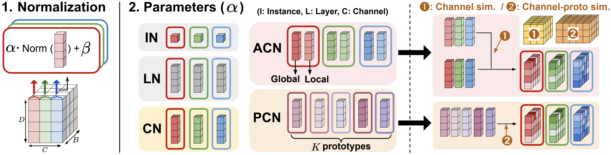

# Channel Normalization for Time Series Channel Identification

### Seunghan Lee, Taeyoung Park$^{*}$, Kibok Lee$^{*}$

(*: Equal advising)

<br>

This repository contains the official implementation for the paper [Channel Normalization for Time Series Channel Identification]([link here]) 

This work is accepted in **ICML 2025**

<p align="center">

</p>

<br>

## 1.Preparation
### 1-1.Installation
```bash
pip install -r requirements.txt
```

### 1-2.Datasets

The datasets can be obtained from [here](https://github.com/wzhwzhwzh0921/S-D-Mamba/releases/download/datasets/S-Mamba_datasets.zip).

<br>

## 2.Train
To run **iTransformer** applied with **channel normalization (CN)**, please run the below code:

```bash
bash /scripts/iTransformer/CN/ETTh1.sh
```

<br>


# Contact

If you have any questions, please contact **seunghan9613@yonsei.ac.kr**

<br>

# Acknowledgement

We appreciate the following github repositories for their valuable code base & datasets:
- [C-LoRA](https://github.com/tongnie/C-LoRA/tree/main)
- [iTransformer](https://github.com/thuml/iTransformer)
- [S-Mamba](https://github.com/wzhwzhwzh0921/S-D-Mamba)
- [RMLP](https://github.com/plumprc/RTSF)
- [TSMixer](https://github.com/ditschuk/pytorch-tsmixer)
